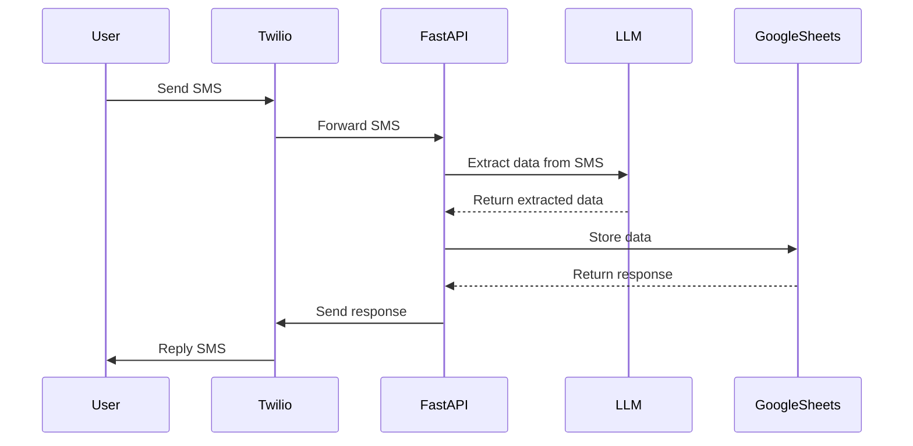

# Snooker Scores App

This project is a FastAPI application used to record match outcomes from our
friendly local snooker league.

- FastAPI app receives SMS messages from users as forwarded by Twilio
- LLM is used to extract data from the SMS messages (LangChain)
- Google Sheets is used to store the data and serve a view of the data to users
- hosted on Cloud Run (GCP)

## User flow



## Project Structure

Only listing the most important directories and files:

```plaintext
📂 appScript/     # Backup of Google Apps Script contents from Google Sheets
📂 app/
├── 📂 llm/               # LLM interface and prompts
├── 📂 tests/             # hey, at least there's some :)
├── 📄 main.py            # Main endpoint
├── 📄 sheets.py          # Google Sheets interface
├── 📄 twilio_client.py   # Twilio interface
├── 📄 models.py          # Pydantic models
└── ...                   # misc. files
```

## Usage

See [User Readme](USER-README.md) for more information.